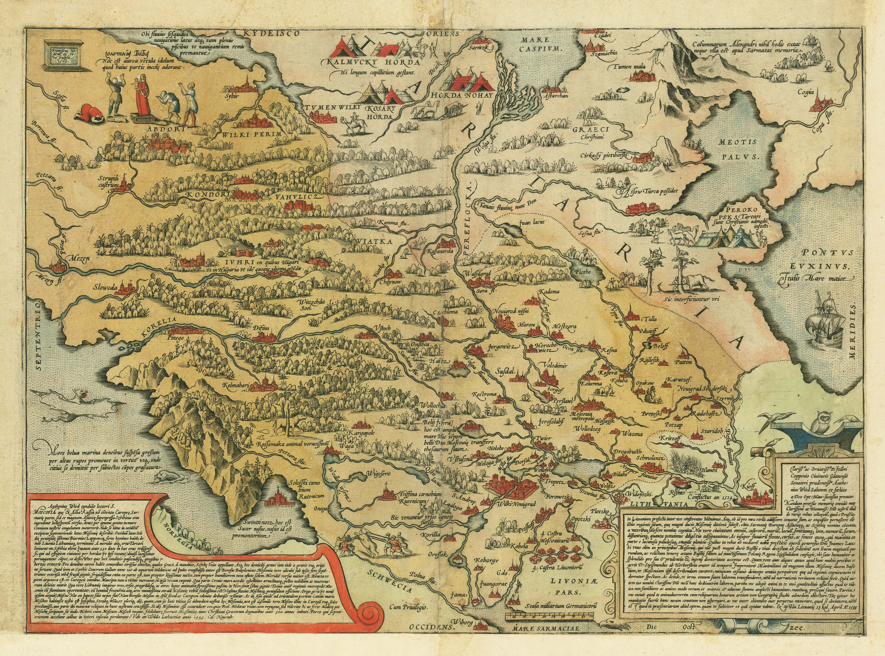

## Раунд 31 — Единое время, стадо на водопое, ночь, следы-цепочки (2026-09-16)

**1. ВОР ВХОДИТ В ЛЕС ПОСЛЕДОВАТЕЛЬНО** — если в маршруте есть лесные локации, они выстраиваются строго: Опушка леса → Лесная поляна → Тёмный лес. То же при побеге из боя: на Поляну вор может уйти, только побывав на Опушке, в Чащу — побывав на Поляне (`applyForestSequence`).

**2. ПАСТУХИ ВОДЯТ СТАДО НА ВОДОПОЙ** — новые жители: пастух **Сила** и пастушка **Зоряна**. Утром (6–10) и вечером (16–20) они водят коров и лошадь на водопой: то на **Реку** (южный берег, у дороги к мосту), то к **Озеру** (южная кромка) — куда именно, решается на каждый день. Днём стадо пасётся на Выпасе, ночью скот загнан в хлев. На выпасе и у воды видны и животные, и пастухи.

**3. НОЧЬЮ НА ЛОКАЦИЯХ НИКОГО** — с 21:00 до 4:59 все жители вне деревни уходят по домам (страховка в npcPresence: расписание не может оставить никого за околицей). Исключение — ВОР: он может находиться на локации и ночью.

**4. НОЧЬЮ СЛЕДЫ ЧИТАЮТСЯ ХУЖЕ** — проверка Внимательности по следам (и обследование, и слепой поиск) с 21:00 до 4:59 идёт со штрафом −15; в сообщениях отметка «Ночь: в темноте и следы читаются куда хуже».

**5. ДОЖДЬ И СНЕГ СМЫВАЮТ СЛЕДЫ** — погода суточная: все следы, оставленные ДО начала осадков (вчера и старше), пропадают («Дождь размыл…» / «Снегопад замёл…»); следы, оставленные уже ПОД дождём/снегом, остаются. У каждого следа теперь есть метка времени `leftAt`.

**6. ВСЕ СКРИНШОТЫ САЙТА ПЕРЕСНЯТЫ** — 9 файлов `assets/screenshots/*.webp` (1280×577) сняты с текущих локаций: тайтл, деревня, таверна при свечах, ночной бой с волком, создание персонажа, Река с цепочкой чёрных следов, внешность, мельница, летняя пасека. Описания обновлены (дом пахаря вместо ульев).

**7. НЕ БОЛЬШЕ 2 СЛЕДОВ НА ЛОКАЦИЮ** — `footprintsForLocation()`: Река (два берега, разделённые мостом) — 2 следа, все остальные локации — 1 след (было 3 везде).

**8–9. СЛЕД — ЦЕПОЧКА ИЗ 6 ЧЁРНЫХ ОТПЕЧАТКОВ** — каждый след рисуется короткой цепочкой (шаг ~14px, лево/право чередуются), вытянутой ВДОЛЬ ДОРОГИ: на Реке — вдоль дороги к мосту (до моста — к югу, за мостом — к северу), на Тракте и у мельницы — вдоль гравийной ленты. Отпечатки чёрные (тинт 0x161616); прочитанный след светится золотом.

**10–12. ЕДИНЫЕ МИРОВЫЕ ЧАСЫ (новый `systems/WorldClock.js`)** —
- мировое время течёт РЕАЛЬНЫМ временем (1 реальная минута = 1 игровая) во всех игровых сценах;
- **во время разговора отсчёт стоит** (п.12): любой открытый диалог ставит часы на паузу (`clockPauseCount`);
- **разговор с НПЦ — всегда 1 час** (п.11): час списывается при закрытии беседы (`chargeTalkTime`, поп-апы одной беседы не дублируют час);
- **обследование следа — ровно 1 час** (п.10);
- живые часы в статус-барах теперь показывают МИРОВОЕ время («🕐 3-й час дня · заутреня отошла»), а не настенные;
- трапеза и благословение больше не добавляют час сверх часа беседы.

**Прочее**: фикс `.hours → .hour` (эмбиент день/ночь в деревне, лесу, на пасеке); фикс невидимого ответа расспроса на локациях (pop-ап ответа стал отдельным окном); вор двигается и от реальных минут — 1 час = 4 его шага.

## Раунд 30 — Лес в трёх частях, видимые следы, свидетели, трапеза и рацион, фикс деревьев (2026-09-16)

**1. ЛЕС РАЗДЕЛЁН НА ТРИ ЧАСТИ** — на развилке теперь 11 локаций (сетка в 2 колонки):
- 🌳 **Опушка леса** — светлая трава, ягодные кусты, грибы; лес «нависает» с дальнего плана стеной деревьев.
- 🌼 **Лесная поляна** — солнечный круг травы, кольцо деревьев по краю, множество цветов (качаются), ягодные кусты, бревно-привал, бабочки.
- 🌲 **Тёмный лес** — густая чаща (бывший «Лес»): 20 деревьев, темнее всех.
Вор теперь может бежать через все три лесные локации (маршрут выбирается из 11 точек).

**2. Выпас** — густая сочная трава: двухцветный покров, 26 травяных пластов, 40 пышных кочек и 42 цветка по всему лугу (зимой — снежные наметы). Стадо и ограда на месте.

**3–6. СЛЕДЫ ВОРА — ВИДИМЫЕ ОБЪЕКТЫ** (пары отпечатков сапог, PIL-текстура):
- На **Реке** следы стоят **или ПЕРЕД мостом, или ЗА мостом** (сторона выбирается один раз на след вора) — в дальней части локации, цепочкой вдоль дороги.
- **Отдельная проверка на каждый след и только единожды на след**: клик по следу = проверка Внимательности (1 тик).
- **Провал — след пропадает** (затоптал — отпечаток исчез).
- **Удача — след СВЕТИТСЯ** (золотая пульсация + подпись «✨ след прочитан») и **поп-ап называет локацию текущего местоположения вора**; повторный клик по найденному — подсказка снова, бесплатно.
- Общий поиск остался только для локаций БЕЗ следов («следов нет — шёл другой дорогой»).

**7. Подсказки НПЦ — единожды.** Расспрос о воре доступен и жителям на локациях; после первого расспроса строчка «Расспросить о воре» у этого НПЦ больше не появляется.

**8. Священник — первый диалог красочный:** батюшка рассказывает о ночной краже из киота, что вор — ПРИШЛЫЙ человек в деревне, как и сам игрок, что лица его не разглядел и советует ПОРАСПРОСИТЬ СЕЛЯН — кто что видел и куда вор мог побежать. Со второго диалога — обычная реплика.

**9. Свидетели о воре — случайны:** на старте игры из девяти жителей (мельник, пасечница, пахарь, Фёкла, Любава, кузнец, тавернщик, охотник, рыбак) случайно выбираются **3–5 свидетелей** (не менее трёх). Свидетель при расспросе выдаёт, где вор находится сейчас; остальные честно отвечают, что не видели («не все могли видеть вора»). Фёкла и Любава получили узлы расспроса.

**10–12. Постоялый двор — еда и рацион у хозяина (Фёдора):**
- 🍲 **Заказать еду (2 д.)** — щи, краюха хлеба и квас: **+1..3 HP** и **ровно 1 час** игрового времени.
- 🎒 **Купить рацион (2 д.)** — «Рацион (хлеб да вода на день дороги)» в инвентарь.
- Цены — строго из репозитория игры **ChroniclesRuthenia** (FoodCatalog: хлеб ржаной 1 д., вода-бурдюк 1 д.; RestService: постоялый двор 2 д./ночь). Названия денег — деньга/алтын/гривна/рубль (gold.gd).

**13. БОНУС — ГЛАВНЫЙ ФИКС РАУНДА:** деревья `deco_tree_*`/`deco_pine_*` с раунда 27 были **ПУСТЫМИ текстурами** (0 непрозрачных пикселей) — деревья не были видны НИГДЕ: ни в лесу, ни в деревне, ни на локациях. Теперь деревья — файловые PIL-PNG ассеты (5 вариантов, прозрачный фон): в деревне выросли 93 дерева, лес/опушка/поляна заросли по-настоящему. Плюс: сброс флага `busyDialog` при входе в локацию (застрявший диалог блокировал клики), цветы на поляне/выпасе крупнее.

QA: 35/35 unit (test30), регрессия 48/48 (test29) и test28 PASS; headless-прогон: развилка 11 кнопок, следы на реке за мостом (3 шт, свечение и исчезновение), опушка/поляна/чаща с деревьями, выпас 52 цветка, деревня с 93 деревьями, консоль без ошибок. SW v28.

# Патч улучшений сайта «Летописи Руси XV века»

Составлено по результатам полного аудита сайта и репозитория (браузерный QA + разбор кода).
Все правки проверены на эталонной реализации; патч применяется поверх ветки `main`.

---

## Что входит

### A. Быстрые победы (критичные)

1. **Шрифты наконец подключены** — `index.html`
   - Раньше `Marcellus` и `PT Serif` использовались в 14 местах, но нигде не загружались → рендерился системный serif.
   - Важно: **у Marcellus нет кириллических глифов** — для русских заголовков добавлен **Prata** (полная кириллица, благородный display-serif), PT Serif — для основного текста, Marcellus оставлен для латинских надписей («The Chronicles of Ruthenia», BRP).
   - `display=swap` + preconnect → без FOIT и блокировки рендера.

2. **Двойная загрузка hero устранена** — `index.html`
   - Было: `preload title.jpg` (2 МБ) + `<picture>` выбирал webp (192 КБ) → 2 МБ лишнего трафика на каждом визите.
   - Стало: preload `title.webp`.

3. **`<h1>` на странице** — `index.html`
   - На сайте не было ни одного h1 (только h2/h3). Добавлен визуально скрытый h1 в hero (текст уже «запечён» в картинке, поэтому скрытый — без визуального дубля, но с полным SEO-эффектом).

4. **No-JS-безопасные reveal-анимации** — `main.js`
   - Было: все секции принудительно скрывались (`opacity:0`) до срабатывания IntersectionObserver → без JS/при ошибке/на печати страница пустая.
   - Стало: флаг `document.documentElement.classList.add('js')`; скрываются только элементы НИЖЕ первого экрана; при `prefers-reduced-motion: reduce` и отсутствии IO анимации отключаются полностью.

5. **`.nojekyll`** — деплой GitHub Pages идёт напрямую, без бессмысленного Jekyll-пайплайна.

6. **Чистый `sitemap.xml`** — убраны невалидные якорные URL (`#trailer` и пр.), добавлена страница `/game/`, актуальный `lastmod`.

7. **Twitter Card + лёгкий og-image** — `index.html`, `assets/images/og-image.jpg`
   - Добавлен отсутствовавший `<meta name="twitter:card" content="summary_large_image">`.
   - Новый `og-image.jpg` 1200×630 (~108 КБ вместо 2 МБ title.jpg) — корректное превью в соцсетях.

8. **`README.md` + `LICENSE` (MIT)** — описание проекта, структура, запуск; лицензия явно разделяет код (MIT) и ассеты (LPC/Quaternius/Chaosium — свои лицензии).

### B. UX и стиль игры

9. **Фикс наложений текста в карточках выбора персонажа** — `game/src/scenes/CharacterSelectionScene.js`
   - Причина: подсказка (y=640) и кнопка «Назад» (y=680) рисовались ПОВЕРХ нижнего ряда карточек (низ y=696); блок навыков шёл с фиксированной позиции и налезал на многострочные описания.
   - Исправлено: карточки стали компактнее (252px вместо 280), навыки начинаются динамически — после фактической высоты описания (`desc.height`), снаряжение прижато к нижней кромке, подсказка/кнопка вынесены за сетку.

10. **Кнопки титульного экрана — в средневековой палитре** — `game/src/scenes/TitleScene.js`
    - Синие/зелёные плоские кнопки («Помощь», «Настройки», «О игре») заменены на охристые/оливковые/кожаные тона, гармонирующие с золотом сайта.

### C. Производительность

11. **AVIF-версии исторических карт** — `assets/images/maps/*.avif` (экономия ~55% против webp).
    Подключение в `index.html` (карты уже размечены `<picture>`, добавьте `<source>` первой строкой):

    ```html
    <picture>
        <source srcset="assets/images/maps/vida_lyatsky_1542.avif" type="image/avif">
        <source srcset="assets/images/maps/vida_lyatsky_1542.webp" type="image/webp">
        
    </picture>
    ```

12. **WebM-версия промо-видео** — выполните локально (в CI-песочнице не хватило памяти):

    ```bash
    ffmpeg -i assets/video/promo.mp4 -c:v libvpx-vp9 -crf 34 -b:v 0 -an \
      -vf "scale=1280:720" -pix_fmt yuv420p assets/video/promo.webm
    ```

    И добавьте `<source>` ПЕРЕД mp4 в секции `#trailer`:

    ```html
    <source src="assets/video/promo.webm" type="video/webm">
    ```

13. **CI-воркфлоу** — `.github/workflows/ci.yml`: Lighthouse CI + проверка внутренних ссылок (lychee) на каждый push.

---

## Как применить

```bash
cd sosnowda.github.io

# 1. Текстовые изменения одним патчем (index.html, main.js, sitemap, README,
#    LICENSE, .nojekyll, CI, обе игровые сцены):
git apply changes.patch

# 2. Бинарные файлы скопировать вручную:
#    og-image.jpg            -> assets/images/og-image.jpg
#    vida_lyatsky_1542.avif  -> assets/images/maps/
#    herberstein_1550.avif   -> assets/images/maps/

# 3. Проверить локально и закоммитить:
python3 -m http.server 8000   # http://localhost:8000
git add -A && git commit -m "feat: аудит сайта — шрифты, SEO, no-js-safe, og-image, фиксы игры"
git push
```

## Итог ожидаемого эффекта

| Метрика | Было | Станет |
|---|---|---|
| Критический путь hero | 2 МБ jpg (preload) | 192 КБ webp |
| og:image | 2 МБ | 108 КБ (1200×630) |
| Карты | webp | avif (−55%) |
| h1 на странице | 0 | 1 |
| Видимость без JS | пустая страница | полностью читаема |
| Соцпревью X/Twitter | не разворачивается | summary_large_image |

---

# Раунд 3 — Дороги-ленты, коллизии, дома-спрайты (обновление игры)

## Деревня (Phaser-демо)

1. **Непрерывные песчаные дороги** — `game/src/data/world.js`, `VillageScene.js`
   - Было: `tileTexture` выбирал path_0/path_1 шахматкой `(x+y)%2` → дороги выглядели мешаниной из вертикальных и горизонтальных тайлов; дверные дорожки обрывались в никуда.
   - Стало: **автотайлинг** по соседям — `path_0` (горизонталь), `path_1` (вертикаль), `path_2` (угол, с поворотом 0/90/180/270°), `path_3` (перекрёсток). Главная улица — широкое сплошное песчаное полотно (`road_0/1`, символ `B`). Сеть: переулки (колонки 2, 7, 13, 19, 23) + северная/южная ленты (ряды 2, 16) — без тупиков и разрывов.
2. **Проверка всех коллизий** — `validateMap()` (BFS от спавна)
   - При каждой сборке сцены деревни проверяется достижимость всех дверей, ворот и каждой дорожной ленты; проблемы падают в `console.warn`. Сейчас: **0 проблем**.
   - Исправлено: колодец `W` был в SOLID, но рисовался травой (невидимая стена) — теперь анимированный спрайт `deco_well_0..3`.
3. **«Визуально проходимые, но непроходимые» места** — корень найден
   - Хитбокс игрока был равен **всему кадру спрайта 64×64 → 72×72px** при видимом персонаже ~26px: игрок «упирался» в пустоту. Стало: честный хитбокс 27×27px (`body.setSize(24,24)`).
   - Заборы/грядки раньше рисовались БЕЗ коллизий (проходимы насквозь) — теперь solid-тела, с калитками напротив дверей; декор больше не перекрывает дороги.
   - Деревья выглядели препятствиями, но были проходимы — теперь непроходимы (ствол), периметр деревни образует естественную границу.
4. **Дома — рисованные избы** (визуальный апгрейд)
   - Вместо плоских коробок из 2 текстур — спрайты `deco_house_0..3` (окна, двери, трубы, свесы крыши); церковь — `deco_church_building` (золотой купол).
   - Мягкие тени под домами; **Y-сортировка** (псевдо-2.5D): игрок за домом рисуется позади, перед домом — поверх. Курицы и деревья тоже Y-сортированы.
   - Полный анализ + источники бесплатных ассетов + совет по 2D/2.5D: `docs/village-visual-upgrade.md`.

## Сайт

5. **PWA-иконки PNG** — `manifest.json`: data:SVG заменены на `favicon-192.png` / `favicon-512.png` (+ `purpose: maskable`).
6. **content-visibility: auto** — `styles.css`: нижние секции (#chronicle, #history, #maps, #brp, #tech, #systems, #trailer, #screenshots, #demo, #support) не рендерятся до прокрутки; `contain-intrinsic-size` против прыжков скролла.
7. **Issue-шаблоны** — `.github/ISSUE_TEMPLATE/` (баг-репорт + предложение улучшения).
8. **sw.js** — кэш поднят до `chronicles-ruthenia-v7`.
9. `window.game` экспортируется для отладки/QA.

---

# Раунд 4 — Атмосфера деревни, печи в избах, интерактивная карта округи

## Деревня (Phaser-демо)
1. **Дым из труб** — раз в ~0.6 с случайный дом выпускает клуб дыма (particle_dust): всплывает, расширяется, тает. Дым редкий и живой, не мешает чтению карты.
2. **Ночное свечение окон** — с 18:00 к 21:00 (и до 5 утра) окна всех домов загораются тёплым светом (ADD-блендинг, 12 окон). Днём свет полностью гаснет.

## Интерьеры
3. **Русская печь с живым огнём** — в домах Авдея, Марфы и старосты (раньше огонь был только в таверне и кузнице): fireplace + анимация int_fire_0..3 + тёплый отсвет на полу (ADD-эллипс).

## Лендинг
4. **Интерактивная SVG-карта игровой округи** (#maps): реки Кистерма, озеро, лес, поле, погост, выпас, мельница, пасека, тракт и деревня — 10 кликабельных меток (Tab + Enter доступны, aria-pressed, aria-live панель). Клик/фокус обновляет панель: название, описание, уровень опасности. Стиль — тёмный пергамент + золото, даш-дорожки к деревне, компас.
5. **Метрика**: цель `rus_map_location` при выборе локации на карте.
6. sw.js → v8.

---

# Раунд 9 — Часовня и Амбар: новые здания, красный угол, дневной свет

## Деревня (Phaser-демо)
1. **+2 здания** (теперь 8): **Часовня Николая Чудотворца** (юг, спрайт deco_chapel с главкой — лор: именно из неё украдена икона!) и **Амбар общины** (северо-восток). Камни/деревья на их местах убраны, дорожки к дверям строятся автоматически, validateMap (BFS) подтверждает проходимость: 8/8 дверей, 0 осиротевших лент.
2. **Бабочки днём / светлячки ночью** — 5 бабочек порхают над травой при свете, ночью 10 зелёных светлячков пульсируют вразнобой (ADD). Переключение плавное по «dark»-коэффициенту.

## Интерьеры
3. **Часовня (без NPC)** — пустой киот с золотой окантовкой и нимбом, свечи, аналой, красный угол. Механики: 🙏 **Помолиться** (+3..8 Воли, раз в игровой день), 🕯 **Пожертвовать 5 д.** (+1 репутация деревни, раз в день), 🔍 **Осмотреть киот** (уникальная улика про верёвку и стеарин — уходит в cluesGathered, видна на развилке).
4. **Амбар (без NPC)** — снопы, мешки зерна (рисованные), бочки, поленница. Механики: ⚒ **Работать (1 час)** (+3..6 д., −4 HP, 15% шанс найти монетку; при HP≤5 отказ), 🌾 **Осмотреть зерно** (атмосфера, 20% шанс сушёных яблок +2 HP).
5. **Красный угол** — в домах старосты, Авдея и Марфы: доска-киот, иконы, красное полотенце с орнаментом, мерцающая лампада (ADD-твин).
6. **Дневной свет** — 2 окна на верхней стене (x=62%/84%, без наложений с текстом/датой), наклонные столбы света на пол (ADD, гаснут к ночи), ночью стекло синеет (интерполяция tint).
7. **Ночные источники света** — печи/камин/горн/свечи/лампада дают тёплые пятна поверх тёмного оверлея (глубина 96 > 95). Интерьеры теперь живут и днём, и ночью.

## Исправления
8. **HUD не перекрывает кнопки** — строка статуса поднята на y=height-88 (при 7 кнопках «Поговорить» была под HUD).
9. **Описание интерьера переносится** (wordWrap 42%) — длинные тексты часовни/амбара не наезжают на окна.
10. showBuildingInfo для зданий без NPC показывает описание вместо «репутации незнакомца».

## Лендинг
11. **Scrollspy** — активный раздел навигации подсвечивается золотом с подчёркиванием (IntersectionObserver + aria-current), focus-visible обводка на пунктах меню.
12. **sw.js** — кэш поднят до `chronicles-ruthenia-v9`.

---

## Раунд 23 — 5 пунктов владельца: без ваучеров, полный бой, лицом к лицу, уникальные NPC, боевые звуки (2026-09-16)

**1. Ваучер «Бесплатный ночлег» УДАЛЁН** (questGenerator.js, InteriorScene.js, VillageScene.js, i18n.js)
- Награда «lodging» больше не генерируется ни у одного заказчика (староста/батюшка/тавернщик получили живые замены: деньги/еда/трава).
- Логика `freeLodging` и все тексты про ваучер вырезаны из меню отдыха: 1 час — 4 д., ночлег 8 часов — 12 д., без исключений.

**2. Полная проверка цикла боя** (браузерный QA, инструментация AudioManager)
- Прогнаны и подтверждены: старт боя (музыка, фон, расстановка), атака игрока (попадание/промах/крит), поглощение брони с обоих сторон, ход врага с анимацией и звуками, убийство врага → победа → возврат в деревню, успешный побег (−30 мин) и провал побега (контратака врага), смерть игрока → экран «Герой пал». Все ветки пройдены в живой сцене, звуковые вызовы подсчитаны.

**3. Бойцы стоят ЛИЦОМ К ЛИЦУ** (CombatScene.js, BootScene.js)
- Багфокс: игрок-рыцарь был развёрнут `setFlipX(true)` СПИНОЙ к врагам (враги справа, рыцарь смотрит влево). Флип снят — рыцарь смотрит вправо.
- Враги-люди (разбойник/вор) теперь в боковой стойке `*_idle_left` — мордой к игроку (раньше — вид сверху/спиной). Волк получил НАСТОЯЩИЙ боковой вид из неиспользуемых листов wolf_full_N: стойка + анимация атаки-рыка, флип влево.
- В атаке враги «подбегают» (walk_left / рык волка) и возвращаются в стойку; герой вздрагивает от полного попадания (knight_hit), при смерти ложится (knight_death).

**4. Уникальная внешность каждого NPC, новая при каждом старте** (новый NpcLook.js, npcNames.js, InteriorScene.js)
- При создании новой игры каждый из 10 NPC получает свой `look`: сдвиг цвета одежды (hue 0–360, внутри одной базовой раскладки — без повторов), насыщенность ×0.85–1.3, яркость ×0.9–1.15 и рост ×0.93–1.07.
- Попиксельная перекраска базового spritesheet и портрета на canvas: одежда меняет цвет, кожа (тёплые тона 10°–55°) остаётся естественной. Кэш `npc_var_<id>` / `portrait_var_<id>` строится один раз за игру.
- Проверено в браузере: тавернщик — буро-красная одежда, кузнец — фиолетовая; портреты совпадают по цвету со спрайтом.

**5. Боевые звуки из DarklandsReborn** (AudioManager.js, BootScene.js, +11 ogg в assets/audio/sfx)
- Из репозитория sosnowda/DarklandsReborn взяты и подключены: 4 вариации попадания мечом, 2 вариации промаха, свист-взмах (начало каждой атаки), удар по доспехам (урон частично погашен), глухой удар по щиту (урон погашен полностью), падение поверженного, вой волка в начале боя с волками.
- Каждая атака теперь озвучена по исходу: тело → «чпок», бронь → металлический кланг, промах → свист. Вариации выбираются случайно — бой не звучит метрономом.
- SW: chronicles-ruthenia-v20 → **v21**.

---

## Раунд 21 — Охота на вора: много-локационная ПОГОНЯ на тиках времени + процедурные поручения с наградами

По спецификации владельца: «вор бежит от деревни в случайном направлении и проходит по двум локациям друг за другом в случайном порядке, оставляя следы… отсчёт времени идёт на перемещение, поиск, разговоры с NPC, вход в дом… селяне с некоторым шансом дают наводку на первую локацию… можно убить, оглушить или убедить вора отдать предмет… после победы — продолжить игру с процедурными заданиями».

### Механика погони (`game/src/data/thief.js` — переписан)
1. **Маршрут вора**: 2 случайные РАЗНЫЕ локации из 9 ходовых точек у околицы (лес/тракт/поле/река/озеро/погост/мельница/пасека/выпас). Заодно устранён баг «road vs road_south» — раньше вора нельзя было поймать на Тракте.
2. **Тики времени (15 игровых минут)**: вор стартует бегом из деревни (2 тика), сидит на первой локации 5–7 тиков, идёт ко второй (2 тика), сидит 3–5 тиков — и сбегает (проигрыш, End «🏃 ВОР СБЕЖАЛ»). Хук `chaseTickHook` в `TimeSystem.tickTime`: ЛЮБОЕ время-тратящее действие двигает вора (дорога между сценами 1–2 тика, поиск 1, разговор 1, вход в дом 1, отдых у костра 60 мин = 4 хода вора!).
3. **Следы**: уходя с локации, вор оставляет следы с направлением. Поиск (проверка «Внимательности»): успех — «следы ведут в сторону X»; провал — можно повторить (каждая попытка — тик); где вора не было — «следов нет» (локация серебрилась на развилке).
4. **Наводки селян** (`askNPC`, проверка «Красноречия»): успех — наводка на ПЕРВУЮ локацию маршрута; если она уже известна — селянин подсказывает, где вор сейчас. Панель улик на развилке пополняется.
5. **ВСТРЕЧА С ВОРОМ**: зайдя в локацию, где вор сидит, игрок СРАЗУ видит его (спрайт enemy_bandit + диалог). 4 варианта: ⚔ Напасть (боёвка BRP), 🤝 Убедить (Убеждение: успех — вор сам возвращает икону и сбегает — тоже победа; провал — вор пускается наутёк, со второй локации — сбегает навсегда), 🌑 Оглушить (Драка: успех — плен, вор ждёт суда старосты), ◀ Отступить.

### Победа больше НЕ заканчивает игру
6. Убив/оглушив/убедив вора, игрок получает «Чудотворную икону» в инвентарь (цель меняется на «Верни её старосте или священнику»). Возврат: у старосты — награда 40–60 д., у батюшки — 20–30 д. + благословение (полное лечение), +10 к репутации деревни. После сдачи иконы — выбор: «🏆 Продолжить игру (поручения жителей)» или «📜 Завершить поход и посмотреть итоги» (End «🏆 ПОБЕДА! ИКОНА ВОЗВРАЩЕНА»; если икону не сдали — «⚖ ВОР ПОВЕРЖЕН»).
7. **Процедурные поручения — полный цикл** (`questGenerator.js` + `InteriorScene`): боевые закрываются победой над нужным врагом (волк/разбойники — проверка типа), небоевые — посещением целевой локации (лес/тракт/поле/река/деревня/церковь/развилка; легаси «road» ≡ «road_south»). Награда выдаётся при разговоре с заказчиком (`claimCompletedQuests`): деньги/еда/травы/благословение/ночлег + бонус репутации. Фикс: раньше выполненные поручения нельзя было сдать (`getActiveQuests` отфильтровывал выполненные).

### UI/полировка
8. **HUD-обратный отсчёт** везде в «действиях»: развилка «⏳ Вор скроется через N действий», локации/пасека «⏳ Действий: N», деревня в статус-баре «⏳Nдейств.» (красный при ≤3).
9. **Сетка кнопок диалогов 2×N** (`utils/ui.js`): при 4+ вариантах кнопки строятся в 2 колонки — чинит обрез/перекрытие подписей (встреча с вором, диалоги старосты/священника/крестьянина с 4–6 выборами).
10. Побег из боя тратит время (30/15 мин), победные диалоги боя — «В деревню!». Улики, хроника и экран итогов дополнены записями погони. EN: +~70 переводов всех новых строк (HUD, встречи, следы, икона, поручения).

QA (agent-browser, локально 5 портов против дискового кэша): init марурута/тики/наводка/следы — node-симуляция + браузер; встреча на мельнице и пасеке (спрайт + сетка 2×2); бой с вором → икона в инвентаре → сдача старосте (+59 д., mainQuestDone); побег через 14 тиков → End «ВОР СБЕЖАЛ»; поручение «Доставить послание» закрылось визитом на тракт, награда выдана; боевые поручения не закрываются визитом; EN-ключи все на месте. SW: v18 → **v19**.

---

## Раунд 20 — Любое разрешение экрана + EN генератора/интерьеров + баня/овин + единая Пасека

Дата: по раундам 19 (пуш e3835ca). Коммит раунда 20 — см. git log.

### 1. Игра и лендинг на ЛЮБОМ разрешении пользователя
- Phaser: Scale.FIT 1280×720 → **Scale.RESIZE** (канвас = всё окно, координаты сцены =
  CSS-пиксели окна; мобильный портрет/ланшафт и любые мониторы без letterbox).
- `utils/ui.js`: реестр авто-анкоров — ВСЕ кнопки (createButton) и диалоги (createDialog)
  сами переезжают при ресайзе (центр/лево/право × верх/середина/низ); подложка диалогов
  растягивается; ширина диалога ограничена окном (мин 240px).
- Меню-сцены (Title, CharacterSelection, CharacterAppearance, CharacterGenerator, Fork,
  Location, Interior, End, Character) — перезапуск с сохранением данных при существенном
  изменении окна (дебаунс 280мс). Бой (CombatScene) — живая перерисовка фона + анкор журнала.
- VirtualControls: джойстик/кнопка E переприклеиваются к нижним углам при ресайзе.
- Лендинг: глобальное правило `img{max-width:100%;height:auto}`; сетка исторических карт
  `minmax(min(400px,100%),1fr)` — больше нет горизонтального скролла на телефонах (RU+EN).

### 2. EN: CharacterGenerator + кнопки интерьеров
- LPC-генератор: заголовок, категории (Телосложение→Body и т.д.), пол, навигация,
  «Случайный облик», «Подтвердить», промпт имени — всё через i18n t().
- Интерьеры: все 17 кнопок действий (Поговорить/Просить денег/Задание/…/Выйти),
  меню подарков, лавки таверны/кузницы, «Нападение!», подсказка у NPC — EN-словарь пополнен.
- Словарь i18n.js + ~55 новых пар RU→EN. RU не изменилась (t() — безопасный фолбэк).

### 3. Баня и овин (§3.1 village-visual-upgrade)
- Новые процедурные текстуры: **deco_banya** (светлый сруб, тёплое окошко, каменная труба,
  шайка-ушат, лавка) и **deco_ovin** (каменный подовин, бревенчатый шатёр, щель-вытяжка
  с оранжевым «овинным духом», снопы).
- Баня (5,10) у двора Авдея у пруда — дымит трубой (smokeBuildings, как рига);
  овин (14,7) у кузницы у главной улицы. Честные коллизии 'H'; BFS-валидатор — 0 проблем.
- По духу владельца: чистый антураж, без монстров и механик.

### 4. Слияние двух Пасек
- Было: статическая «картинка» пасеки в LocationScene + ходячая ApiaryScene.
- Стало: ОДНА ходячая сцена. Кнопка пасеки на развилке и кнопка «Пасека — прогулка»
  ведут в ApiaryScene; в режиме охоты на вора (hunt:true) на пасеке появляются
  счётчик ходов и «🔍 Искать следы (проверка Внимательности)» — та же логика
  searchLocation('apiary'), что была в LocationScene; бой с вором возвращается
  через Location('apiary') → редирект в ApiaryScene.
- Из LocationScene удалена статическая ветка отрисовки пасеки (~85 строк) и фон.

### Проверка
- node --check всех правленых файлов; buildMap+validateMap — 0 проблем; локальный QA
  (http.server + agent-browser): меню/генератор/деревня/интерьер/пасека-охота/бой при
  1280×720 и мобильном 390×844 + живой ресайз.

## Раунд 10 — EN-версия лендинга + scrollspy-fix (2026-09-15)

1. **EN-версия лендинга** — `en/index.html` (новый файл)
   - Полный перевод всех 13 секций: about, chronicle (11 карточек), history, maps (SVG-карта: 10 маркеров с data-desc на английском), BRP, tech, systems, trailer, screenshots, demo, support, footer.
   - `lang="en"`, canonical `https://sosnowda.github.io/en/`, og:locale `en_US` + `og:locale:alternate ru_RU`, JSON-LD с `inLanguage`.
   - Честное примечание в секции Demo: «in-game text is currently in Russian; full English localization is planned».
   - Все ассеты по относительным путям `../` (картинки, видео, CSS, JS, игра).

2. **hreflang + язык** — `index.html`, `en/index.html`, `sitemap.xml`
   - На обеих страницах: `<link rel="alternate" hreflang="ru|en|x-default">`, canonical, og:locale:alternate.
   - sitemap.xml: добавлен `/en/` с xhtml:link-альтернейтами (три языка-альтернейта на каждый URL).

3. **Переключатель RU/EN в шапке** — `index.html`, `en/index.html`, `styles.css`
   - Компактная «пилюля» в конце навигации (в мобильном меню тоже), активный язык залит золотым градиентом; классы `.lang-switch`/`.lang-link` с переопределением специфичности `.nav-links a`.
   - aria-label «Выбор языка / Language selection», aria-current на активном.

4. **Фикс scrollspy** — `main.js`
   - Было: активная секция выбиралась по максимуму intersectionRatio → высокие секции («История») проигрывали коротким соседям («Скриншоты» подсвечивалась при скролле к «Истории»).
   - Стало: детерминированный rAF-обработчик scroll/resize — активна последняя секция, чей верх прошёл порог 140px под шапкой; цели сортируются по позиции в DOM (порядок ссылок в меню ≠ порядок секций).

5. **Локализация JS-строк по языку страницы** — `main.js`
   - d100: «Бросаем…/Удача!/Особый!/Успех/Провал!» ↔ «Rolling…/Luck!/Special!/Success/Failure!» (по `document.documentElement.lang`).
   - SVG-карта: «Опасность: низкая/средняя/высокая» ↔ «Danger: low/medium/high».

6. **SW-регистрация на подпапках** — `main.js`
   - `register('sw.js')` → `register('/sw.js')` — иначе на `/en/` SW не регистрировался (относительный путь = `/en/sw.js`).

7. **SW v9 → v10** — `sw.js` (инвалидация кэша HTML/CSS/JS после релиза).

---

## Раунд 11 — Сундуки с лутом, живность на LPC-спрайтах, цветы (2026-09-15)

1. **Сундуки с лутом** — `game/src/data/chests.js` (новый), `VillageScene.js`, `BootScene.js`
   - 4 сундука в деревне: у таверны (мелочь 2–5 д.), за амбаром (припасы), тюк у колодца (1–3 д.), позолоченный ларец за церковью (редкий, 10–16 д. или медная иконка).
   - Позиции проверены скриптом (BFS от спавна): все тайлы проходимы и достижимы, дороги/двери не перекрыты.
   - Механика: «раз в игровой день» на сундук (q.chestsOpened = [{id, day}], dayKey из TimeSystem); лут по взвешенной таблице — деньги / яблоко (+2 HP) / медная иконка (+1 репутация деревни).
   - Обратная связь: искра над неоткрытым (у редкого — золотая и крупнее), при открытии смена текстуры на открытую, вспышка искр, всплывающий текст лута, звуки (click/heal/level-up), записи в ActionLog, +5 минут игрового времени.
   - Текстуры сундука (закрыт/открыт) рисуются процедурно в BootScene — без сетевых запросов.

2. **Живность деревни на настоящих спрайтах** — `VillageScene.js`
   - Эмодзи-курицы 🐔 заменены на LPC spritesheet-анимации (walk 4 направления + idle + eat): 4 курицы у амбара и южной ленты + корова на западе у домов.
   - Поведенческий конечный автомат: idle → walk (с поворотом мордочки по направлению) / eat (клевание, щипание травы), Y-сортировка по глубине.
   - Ночью (dark > 0.7) живность прячется по домам (плавное исчезновение через alpha).

3. **Полевые цветы и травяные кочки** — `BootScene.js`, `VillageScene.js`
   - Процедурные текстуры: ромашка, мак, лютик + тёмная кочка. Кластеры на ~14% травяных тайлов (1–2 цветка) + кочки на ~8%.
   - Половина цветков покачивается на ветру (angle-твин 1.8–3.4 с). Зимой (season = winter по месяцу игрового календаря) цветы не показываются.
   - Декор без коллизий (глубина 0.3), тайлы сундуков пропускаются.

4. **Фикс наложения UI** — `VillageScene.js`
   - Название деревни рисовалось с y=6 и при длинных именах («Двинская слобода») наезжало на кнопку «Инвентарь» в статус-баре. Перенесено на y=34, под строку кнопок.

5. QA: node --check (ESM) — OK; BFS-валидация сундуков — ALL CHESTS OK; live-прогон (http.server + agent-browser): открытие сундука (деньги +3 д., яблоко +2 HP), дневной лимит (повтор заблокирован), текстуры/искры/промпт «Нажмите E — Открыть: …», 5 животных с анимациями, ночь: 16 свечений окон + животные спрятаны (0), зима: цветы скрыты, консоль без ошибок. Скриншоты: /home/z/qa11-*.png.

---

## Раунд 12 — Деревенские активности: костёр, пруд с рыбалкой, крест, тайники (2026-09-15)

1. **Костёр у таверны с отдыхом (§5.4 роадмапа)** — `world.js`, `BootScene.js`, `VillageScene.js`
   - Новый тайл 'F' (12,7) у главной улицы: каменное кольцо с поленьями, анимированное пламя (3 процедурных кадра, ADD-режим), тёплый свет на земле с живым мерцанием (ярче ночью), редкий дымок.
   - Механика «Отдохнуть у костра» (E): подтверждение диалогом → fade-to-black → 1 час игры, HP и Воля до максимума. При полных силах время не тратится («Ты полон сил»).

2. **Пруд с причалом и рыбалка (§5.1 роадмапа)** — `world.js`, `BootScene.js`, `VillageScene.js`
   - Пруд '~' (6–10, 14–15) на юго-западе; поверх воды — проходимые деревянные мостки 'P' (9, 14–15) с текстурой досок (планки, гвозди, волокна). Дерево (7,15) убрано под воду; камень (8,13) остался «валуном у воды».
   - Декор: камыш по берегам (до 8 кустов, автопоиск кромки, покачивание 1.5–2.1 с), кувшинки на воде (4 листа). Зимой — ледяной тинт воды 0xB8D4E8, кувшинки спрятаны, камыш блёклый.
   - Механика «Рыбалка» (E у воды/на причале): первый улов за день — +3 ❤ («свежая рыба»), 1 час; повторно — «не клюёт», 15 минут. Зимой диалог называется «Лунка во льду».

3. **Каменный крест с молитвой (§5.1 роадмапа)** — `world.js`, `BootScene.js`, `VillageScene.js`
   - Тайл 'X' (3,12) в тихом углу у околицы: процедурный замшелый крест с резьбой-зарубками (Y-сортировка, честная коллизия), ночью у подножия загорается «лампада» (мягкое золотое свечение по dark-коэффициенту).
   - Механика «Помолиться у креста» (E): 1 час, +2..5 Воли, раз в игровой день (тихая альтернатива часовне); золотые искры при молитве.

4. **Домашние тайники в интерьерах** — `chests.js`, `InteriorScene.js`
   - «🎒 Мой тюк» в таверне и «🎒 Мой узел» в амбаре: раз в игровой день, скромный лут (яблоко +2 ❤ или 1–4 д.), 5 минут времени. Работают через те же q.chestsOpened-помощники, что и уличные сундуки.

5. **Сундуки стали непроходимыми** — `world.js`, `VillageScene.js`
   - Под каждым из 4 сундуков теперь тайл 'C' с честной физической коллизией (раньше игрок проходил сквозь сундуки наискось). BFS-валидация: все двери/ворота/причал достижимы, PROBLEMS: NONE.

6. **🐛 ФИКС: кнопки диалогов нельзя было нажать в деревне (критичный, существовал давно)** — `utils/ui.js`
   - createDialog добавлял кнопки в контейнер со scrollFactor 0, но собственный scrollFactor кнопок оставался 1: рендер шёл по родителю, а хит-тест Phaser считал кнопку в мировых координатах → при прокрученной камере клики промахивались на величину скролла. В деревне камера прокручена почти всегда → все модальные диалоги (включая финальные!) были некликабельны. Фикс: btn.setScrollFactor(0).
   - Проверено живым кликом мыши: диалог отдыха закрывается, колбэк срабатывает.

7. **🐛 ФИКС: SFX не играли вовсе (существовал давно)** — `systems/AudioManager.js`
   - playSound() смотрел только в this.sounds, который никто не наполняет (addSound не вызывается), хотя реальные файлы загружены в this.realSounds → каждый вызов падал в warn «Sound not found». Фикс: fallback на realSounds. Затрагивало сундуки (раунд 11) и все новые механики.

8. **🐛 ФИКС: анимации животных (консольный спам «Missing animation»)** — `VillageScene.js`
   - walk: игралось `animal_chicken_walk_walk_down` (двойное _walk_), а создана `animal_chicken_walk_down`; eat: игралось `animal_chicken_walk_eat`, а создана `animal_chicken_eat`. Фикс ключей + проверка через anims.exists.

9. **🐛 ФИКС: животные ходили по воде/камням** — `VillageScene.js`
   - Цель прогулки теперь проверяется по SOLID (вода, камни, колодец, сундуки, крест, стены); при попадании на непроходимое животное остаётся на месте. Курица (9,14) переехала на (12,14) — её дом ушёл под пруд.

10. **🐛 ФИКС: переполнение ряда кнопок таверны** — `InteriorScene.js`
    - 10 кнопок × 130px = 1372px > 1280 — «Выйти» обрезался краем экрана. Ширина кнопок теперь адаптивная: `min(130, (width−32−gap·(n−1))/n)`.

11. **SW v10 → v11** — `sw.js`.

12. QA: node --check всех 8 файлов — OK; BFS-валидация карты — PROBLEMS: NONE; live-прогоны (http.server 8090 + agent-browser, свежая сессия на каждый фикс): отдых у костра (HP 5→11, Воля 2→11, +1 час), рыбалка (+3 ❤, +1 час, дневной лимит «не клюёт» +15 мин), молитва у креста (Воля +5, +1 час, метка дня), тайники таверны/амбара (+3 д., метка дня, повтор заблокирован), сундук-коллизия (толкался 1.5 с — не прошёл), зима: лёд на пруду/кувшинки спрятаны, ночь: свечение костра + лампада креста + окна, консоль полностью чистая (0 warn/ошибок). Скриншоты: /home/z/qa12-*.png.

## Раунд 13 — Тёмный лес: ходячая локация с волками, сбором и тайником разбойников (2026-09-15)

1. **`data/forest.js` — новая карта Тёмного леса (§5.1 роадмапа)**
   - ASCII-карта 30×22 тайлов (48 px): густые/одинокие деревья, валуны, поваленные стволы, кусты ягод, лесной подлесок 'f'.
   - 24 точки сбора из карты: грибы (+2 ❤), кусты ягод (+1 ❤, собирать с соседней клетки), зверобой (+3 ❤) — каждая раз в игровой день (dayKey, как у сундуков).
   - Брошенный лагерь разбойников (кострище 'C' + тайник 'S'): лут 12–20 д. один раз за игру, шанс 35% засады — «разбойник вернулся» → бой.
   - 3 волчьих логова + WOLF_CFG (патруль 70 / погоня 205 / отступление 185 px/с, агро 152 px, поводок 345 px от логова).
   - `validateForestMap()` — BFS от спавна: выход, все точки сбора, тайник, логова. Оффлайн-прогон: PROBLEMS NONE, 488/660 тайлов достижимы.

2. **`scenes/ForestScene.js` — полноценная ходячая сцена (~700 строк)**
   - Тайлы 48 px (мир 1440×1056 больше экрана — камера скроллится), честные коллизии (тело 24×24), Y-сортировка каноп, джиттер позиций деревьев для органичности.
   - Волки на LPC-текстурах enemy_wolf (4 направления walk/idle): патруль вокруг логова → агро при сближении → погоня (быстрее игрока!) → бой при контакте; теряют интерес за пределами поводка.
   - **Напуганная стая**: исправление опечатки опустим; **Напуганная стая**: после победы/побега в бою стая «держится подальше» 4 игровых часа (q.wolfScaredUntilMin): волки отступают вместо погони, баннер-предупреждение в HUD.
   - Возврат после боя в ТОЧКУ схватки (registry 'forestReturnPos'), а не на спавн.
   - Атмосфера: лесная мгла (MULTIPLY), световые столбы с дыханием (ADD), 12 дрейфующих клочьев тумана, падающая листва (screen-space эмиттер), 9 светлячков ночью, тлеющее кострище лагеря (свечение ярче ночью).
   - HUD: статус-бар как в деревне, [📜 Персонаж] [🎒 Инвентарь], подсказки «Нажмите E — …», F1 — помощь по лесу.
   - Мобильные: VirtualControls как в деревне.

3. **`BootScene.createForestTextures()` — 7 процедурных текстур**: грибы (18×14), куст ягод (26×22, грозди по 3), зверобой (16×18), тайник-бугор с корягой и крестом-затвором (30×20), поваленный ствол со мхом (44×16), клок тумана (128×128 радиальный), листок для листвы. Ноль сетевых запросов.

4. **`ForkScene.js`** — кнопка «🌲 Тёмный лес — прогулка» (тёмно-зелёная, отдельная от поиска следов вора); «Вернуться»/«Карта» сдвинуты ниже.

5. **`CombatScene.js`** — `fromScene: 'Forest'`: победа/побег в бою с волком или засадой возвращают в лес (не в деревню); при победе над волком стая пугается на 4 часа.

6. **🐛 Фикс латентного бага F1 (обе сцены)**: `scene.launch('Help')` ссылался на несуществующую сцену — клавиша помощи молча не работала С самого первого релиза. Теперь F1 открывает контекстный диалог помощи (в деревне — про дома/сундуки/костёр, в лесу — про волков/грибы/тайник).

7. **QA-находки и правки по ходу**:
   - ден_mid (14,13) был в 3 тайлах ходьбы от спавна — волк выслеживал игрока прямо на точке появления (воспроизведено в живом прогоне: волк пришёл, догнал, бой). Перенесён на (18,14), валидация: PROBLEMS NONE.
   - `buildHUD()`: деструктуризация без height → ReferenceError обрывал создание подсказки (найдено через пробу updateNearestInteractable).
   - Тайл 32 → 48 px: при 32 мир (960×704) был меньше экрана — вся карта видна без скролла.

8. **SW v11 → v12**. Сцены не кэшируются (network-first) — бамп только версии.

9. QA: node --check всех 6 файлов OK; BFS PROBLEMS NONE; живой прогон (http.server 8090 + agent-browser, детерминированный флоу через Phaser API): ворота → развилка → лес; сбор грибов (HP 6→8, метка дня, точка скрылась); тайник (+18 д., маркер погас); засада (mock Math.random) → диалог → бой с разбойником → победа → возврат в лес; бой с волком (меч 5+8 урона, ответка волка) → победа → возврат в точку схватки + баннер «Стая напугана» + волки держат дистанцию 195+ px; ночь 23:00 — 9 светлячков, тление кострища 0.32, мгла 0.13; выход к околице → развилка; мобильный 390px — виртуальный джойстик, сцена живая; консоль чистая. Скриншоты: /home/z/qa13-*.png (7 шт).

---

## Раунд 14 — Погодная система + честные кнопки боя (2026-09-15)

1. **`systems/Weather.js` — новая погодная система (детерминированная по дню)**
   - Погода дня вычисляется FNV-1a-хешем от `год-месяц-день` → **все сцены в один игровой день видят одинаковую погоду** (деревня, лес, развилка, текстовые локации, бой).
   - 5 типов: ☀️ Ясно (46%) / ☁️ Пасмурно (26%) / 🌧 Дождь (21%) / ⛈ Гроза (7%); зимой: 🌨 Снег (42%) / пасмурно / ясно.
   - `applyWeatherVisuals(scene)`: MULTIPLY-затемнение неба + экранный эмиттер осадков (капли 2×14 с наклоном ветра / мягкие снежинки 5×5 с дрейфом). В грозу — редкие вспышки молний (расписание 7–16 с, вспышка 70+50+70 мс).
   - Геймплейные хуки: в дождь/грозу **рыба клюёт лучше** (+4 ❤ вместо +3, свой текст диалога), в дождь/грозу **волки слышат хуже** (радиус агро 152 → 99 px, −35%).

2. **🐛 Фикс честности кнопок боя (CombatScene)** — обе кнопки «⚔ Мечом»/«➶ Луком» били **экипированным** оружием: герой с луком по кнопке «Мечом» наносил удар луком с надписью «Лук» в журнале. Теперь: основная кнопка называется по реально экипированному оружию (`⚔ Лук`) и бьёт им; добавлен честный резерв **«🤜 Кулаками»** (навык brawl, 1d3+DB, скрыта если экипировка — кулаки); раскладка 4/5 кнопок выравнивается по центру. Проверено вживую: «Кулаки: попадание! Урон 8», «Лук: 91 — промах!».

3. **Интеграция погоды в 5 сцен**: VillageScene (затемнение 92 / осадки 96, HUD-статус дополнен иконкой погоды), ForestScene (осадки 99 поверх листвы, иконка в заголовке, волчий агро-модификатор), CombatScene (94/96), LocationScene (94/96, иконка в строке даты), ForkScene (иконка+название в строке даты). Интерьеры не затронуты — там и так свой микроклимат.

4. **`BootScene`**: процедурные текстуры `weather_rain` (2×14, светло-голубая капля со светлым краем) и `weather_snow` (5×5, ядро+ореол). Ноль сетевых запросов.

5. **SW v12 → v13**.

6. QA: node --check 7 файлов OK; детерминированный подбор дат под каждый тип погоды (тот же FNV-1a): деревня в дождь (случайный старт 1490-09-27 сам попал в дождь — эмиттер weather_rain, иконка 🌧 в статусе), рыбалка в дождь HP 5→9 (+4) с текстом «под моросящим дождём», гроза (1401-09-04) — ⛈ + вспышка-прямоугольник, зима (1401-12-03) — 🌨 снежинки + лёд на пруду + цветы скрыты; бой с волком: кнопки «⚔ Лук | 🤜 Кулаками | Уклон | Трава | Бежать», оба типа атак честно в журнале; развилка «☀️ Ясно», Ржаное поле в дождь — «🌧 Дождь» + капли; мобильный 390px — титул живой; консоль 0 ошибок за всю сессию. Скриншоты: /tmp/qa14-*.png.

## Раунд 15 — EN-локализация ядра демо + рабочие настройки звука + зимний снег (2026-09-15)

1. **`systems/i18n.js` — мини-словарь EN для демо (новый модуль)**
   - Принцип: русский текст — источник и ключ. `t('Новая игра')` → 'New Game' при lang=en; `tf('Открыть: {0}', label)` — шаблоны с подстановкой; `tk('title.help.body', ruFallback)` — большие тексты по семантическим ключам. **Непереведённые места безопасно остаются русскими** — частичное покрытие не ломает игру (~200 словарных статей + 5 больших текстов).
   - Определение языка: `?lang=en|ru` (язык сессии, НЕ пишется в localStorage) → ручной выбор тумблером (пишет `gameLang`) → `document.documentElement.lang` → 'ru'. Визит с EN-лендинга не «приклеивает» EN к следующим визитам.

2. **EN-локализованы ядровые поверхности** (17 файлов):
   - TitleScene: кнопки, помощь (полный EN-блок), «О игре» (с честной пометкой «quest and dialogue texts are currently in Russian»), настройки.
   - TimeSystem: EN-месяцы/дни недели/времена суток; дата «Saturday, 5 September 6956 A.M. (1448 AD), in the morning» — год от С.М. с уточнением от Р.Х.
   - Weather: Clear/Overcast/Rain/Thunderstorm/Snow (getWeather возвращает локализованную копию).
   - ForkScene: заголовок/кнопки/счётчик ходов/улики/карта местности (9 маркеров). mapLocations: имена+описания 9 локаций.
   - VillageScene: промпты «Press E — Open: Chest by the tavern», метки дверей/ворот/костра/рыбалки/креста, статус-бар («💰5 d.», «⏳12 turns»), инфо-панели зданий (NPC/репутация/занятие). Сундуки/тайники/лут («+5 dengas», «Apple: +2 ❤»).
   - Интерьеры: 8 названий + описания + имена NPC (Elder Miroslav, Father Savvatiy…), товары кузницы.
   - ForestScene: заголовок/метка выхода/тайник/засада/помощь; сбор («Mushrooms», «Pick mushrooms (+2 ❤)»).
   - LocationScene: кнопки поиска/выхода, HUD («✦ Will», «⚔ Sword»), заголовки результатов.
   - CombatScene: честные кнопки («⚔ Bow», «🤜 Bare fists», Dodge/Herb/🏃 Flee), журнал боя («Bow: hit! Damage 38 (roll 1) [CRIT!] [SPECIAL!].», «Wolf is slain!»), имена врагов (Wolf/Bandit/The Icon Thief), оружие/броня/навыки/архетипы героев, деньги («руб.» → «rub.»).
   - CharacterSelectionScene: заголовок/кнопки/карточки героев (архетипы Ranger/Warrior/Sleuth/Adventurer + описания + навыки + снаряжение) / панель генерации (5 паттернов).
   - Уровни репутации: «свой человек» → «one of their own», «враг» → «enemy» и т.д.

3. **Переключатель языка 🌐** — новый тумблер в «⚙ Настройки» титульника: «🌐 Язык: English → Русский», переключение сохраняет выбор и перезагружает страницу; `?lang=` из URL вычищается перед перезагрузкой (иначе параметр перебил бы ручной выбор). Ссылка «Launch the game» на EN-лендинге теперь ведёт на `/game/?lang=en`.

4. **🐛 Фикс: панель настроек звука была декоративной** — тумблеры писали `gameSettings` (soundEnabled/musicEnabled/stepsEnabled), которые **никто не читал**; AudioManager всех сцен слушает `settings.audio.*` — реального отключения звука не было ни с первого релиза. Теперь: «🔊 Все звуки» / «🎵 Музыка» / «🔊 Эффекты (SFX)» пишут `settings.audio.musicMuted/sfxMuted` в registry (AudioManager реагирует живо, во всех сценах) + персист в `localStorage 'gameSettings.audio'` (совместим с SettingsManager на TestPage); `BootScene.create()` восстанавливает настройки при старте. «Звуки шагов» переименованы в «Эффекты (SFX)» — шаги и есть основной SFX-канал.

5. **🐛 Фикс: наслоение панелей** — `showSettings()`/`showHelp()` в Title уничтожали только overlay (depth===200), оставляя кнопки/тексты прошлой отрисовки: каждый клик тумблера дублировал панель, повторный F1/Настройки — наслаивал окна. Теперь уничтожается всё с depth>=200.

6. **Зимняя стилизация деревни** — процедурная текстура `deco_snow_patch` (26×12, трёхслойный сугроб): зимой на травяных тайлах раскидывается ~12% снежных наметей (вместо скрытых цветов) + зимний лёд пруда/снегопад из раунда 12/14. Ноль сетевых запросов.

7. **SW v13 → v14**. `en/index.html`: ссылка запуска демо с `?lang=en`.

8. QA: node --check 18 файлов OK; live-прогоны (http.server 8090): EN — титул («New Game»/«15th century · The quest for the stolen icon»), карточки героев, Village HUD «❤11/11 ✦11/11 ⚔45% 💰5 d. 📅Saturday, 5 September 6956 A.M. (1448 AD), in the morning ☀️ ⏳12 turns ⭐0», промпты «Press E — Tavern» / «Press E — Open: Chest by the tavern», открытие сундука «+5 dengas», развилка (9 локаций + карта), Ржаное поле «🔍 Search for traces (Notice check)», бой: кнопки «⚔ Bow|🤜 Bare fists|Dodge|Herb|🏃 Flee», журнал «Bow: hit! Damage 38 (roll 1) [CRIT!] [SPECIAL!] → Wolf is slain! → The enemy is slain!», имя врага «Wolf»; RU-регрессия чистая («Нажмите E — Таверна», «Дождь»); настройки: тумблер «All sound: ON→OFF» → registry settings.audio.* + localStorage, ПОСЛЕ перезагрузки восстановлено (BootScene), дублей панели нет; язык: EN→RU тумблер → URL очищен от ?lang= → перезагрузка → RU ✓; зима (декабрь): 16 снежных наметей, цветы скрыты; мобильный 390px EN — панели в кадре; консоль 0 ошибок. Скриншоты: /tmp/qa15-*.png.

## Раунд 16 — Пасека: ходячая локация с пчёлами + воробьи в деревне + фикс свитка (2026-09-15)

1. **🐛 FIX: наложение текста на вкладке «Характеристики» свитка персонажа** (`CharacterScene.js`)
   - Блок характеристик вырос до 7 строк (HP/MP/бонус урона) и заканчивался на ~+184px, а «Снаряжение» рисовалось с +140px → строки HP/MP/доспеха печатались друг поверх друга (найдено QA на проде).
   - Снаряжение опущено на +200..+246, деньги на +276 — проверено в браузере, колонки читаются.

2. **🐝 Пасека — новая ходячая локация** (по образцу Тёмного леса, бэклог §5.1):
   - `data/apiary.js` (новый): ASCII-карта 26×20 (лесная поляна, 6 колодных ульев в два ряда, избушка пасечника, дымокур, выход на юге), BFS-валидатор проходимости (ульи/дымокур/выход достижимы — проверено), конфиг механик.
   - `scenes/ApiaryScene.js` (новый): ходьба WASD/стрелки/тач, сбор мёда (+5 ❤, раз в игровой день с улья), дымокур (40 игровых минут тления: пламя + дым-клубы + тёплый отсвет; под дымом сбор безопасен), 18 пчёл-декораций кружат над ульями, избушка, цветы, лучи солнца, пыльца, светлячки ночью, погода, день/ночь, HUD со статусом пчёл/дымокура, помощь F1, виртуальный джойстик.
   - Системные хуки: пчёлы СПЯТ зимой/в дождь/ночью → сбор безопасен, но мёда вдвое меньше (+2 ❤); без дыма в сезон — 55% «Рой поднялся!» → бой.
   - QA-урок внутри раунда: месяцы индексируются с сентября (церковный календарь) — первая версия сезонности пчёл дублировала пороги неверно, заменена на честный импорт `getSeason` из TimeSystem.

3. **⚔ Новый враг «Рой пчёл»**:
   - `data/characters.js`: шаблон (STR 18/DEX 82 — слабый, но вертлявый; жала 1-4).
   - `scenes/CombatScene.js`: процедурный анимированный спрайт роя (3 кадра «кипящего» облака пчёл), возврат на пасеку после победы/побега; после разгона роя пчёлы не атакуют 4 игровых часа (зеркало волчьей «стыни»).

4. **🎨 Процедурные текстуры** (`BootScene.js`): колодный улей (дуплянка с плашкой и летком), пчела, дымокур (дёрн+угли), 3 кадра боевого роя, воробей; анимация smudge_burn фильтрует существующие кадры (костровых кадров три, не четыре — чинит консольный warning «campfire_flame_3 not found»).

5. **🐦 Воробьиные стайки в деревне** (§3 village-visual-upgrade — атмосфера): 2 стаи (у колодца и перед таверной) клюют зерно и прыгают; при приближении героя (<76px) разлетаются с взмахами, через 6–12 сек возвращаются, если герой отошёл; ночью спрятаны (порог темноты согласован с updateHUD).

6. **🌐 i18n**: EN-статьи для всех новых строк (ульи/дымокур/рой/подсказки/помощь «APIARY — HONEY & WAX», кнопка развилки «Apiary — honey & wax»). Проверено в EN-режиме: титул сцены, промпты, статус.

7. **Регистрация**: сцена Apiary подключена в `game/index.html`; кнопка «🐝 Пасека — мёд и воск» на развилке (между Тёмным лесом и возвратом).

QA раунда (локально + agent-browser): BFS-валидатор 0 проблем; флоу «вход → рой (форсированный) → бой → возврат на место → дымокур → безопасный сбор → лечение с капом по HPmax → выход»; свиток без наложений; EN-промпты; мобайл 390px; консоль без ошибок и предупреждений (0 campfire_flame_3). SW: v14 → **v15**.

## Раунд 17 — Пчёлы — только антураж (воля владельца) + окна с дневным светом + рига/амбар + живые погост и мельница (2026-09-15)

1. **🐝➡️🎨 Пчёлы больше НЕ враги — только антураж и анимации пасеки** (прямое указание владельца: никакого боя с пчёлами и никакой добычи мёда):
   - `data/characters.js`: шаблон врага «Рой пчёл» (DEX 82, жала 1–4) УДАЛЁН.
   - `scenes/ApiaryScene.js`: вырезаны механики сбора мёда (+5❤/+2❤), дымокура (40 мин тления), 55% «Рой поднялся!» → бой, «рой разогнан на 4 часа». Вместо них — наблюдение: E у улья выдаёт живые заметки о пчёлах («Сторожевая пчела дежурит у летка…», 5 вариантов), +2 игровых минуты.
   - Кадры боевого роя не выброшены, а ПЕРЕОСМЫСЛЕНЫ: анимированные «рои-мерцания» (bees_swarm, 3 кадра «кипящего» облака) теперь висят НАД двумя ульями и медленно дышат — анимации пасеки как и просил владелец. Спят зимой/в дождь/ночью вместе с остальными пчёлами.
   - Дымокур остался декорацией: мирно тлеет всегда, дым-клубы идут постоянно, угли светятся ночью (без взаимодействия).
   - `scenes/CombatScene.js`: ветка спрайта enemy_bees и возвраты «на пасеку после боя» удалены; `scenes/ForkScene.js`: кнопка теперь «🐝 Пасека — прогулка» (EN: «Apiary — a stroll»).
   - `data/npcSchedules.js`: пасечник в полдень «проверяет ульи» (не «собирает мёд»).
   - i18n: помощь «APIARY — A QUIET STROLL», новые строки заметок; дым/рой/мёд-статьи удалены.

2. **🪟 Окна с дневным светом в интерьерах — жизнь в лучах** (`InteriorScene.js`, развитие раунда 9):
   - Столбы света «дышат» (мягкий альфа-твин 0.72↔1.0).
   - В лучах кружится золотая ПЫЛЬ (ADD-эмиттер particle_spark на зону трапеции, гаснет вместе со светом).
   - Непогода за окном тускнит свет: дождь/гроза/снег → столбы вполсилы (согласовано с погодной системой раунда 14).
   - Ночью из окон льётся слабый ЛУННЫЙ столб (холодный синий ADD), стекло синеет как раньше.
   - На каждом подоконнике — ЦВЕТОЧНЫЙ ГОРШОК с зеленью и цветом (рисованный, без эмодзи).

3. **🏚 Новые типы зданий: РИГА и собственный АМБАР** (§3 village-visual-upgrade):
   - Амбар общины больше не клон таверны: новая процедурная текстура deco_barn (96×80) — широкий сруб, двойные ворота с X-раскосами, сеновал-окно с торчащим сеном, самцовая крыша с дранкой, торцы брёвен.
   - РИГА-сеновал (deco_riga, 112×72) у околицы на юго-западе: открытый закром с сеном, глухая бревенчатая половина, широкая провисшая кровля, ласточкины гнёзда под свесом, просыпавшееся сено; слегка дымит (овинный дух) — добавлена в дымовую систему деревни.
   - Детали дворов по плану: 3 СТОГА СЕНА (два за амбаром + один у риги), ПОЛЕННИЦА у кузницы, ТЕЛЕГА с сеном у дороги — все с честными коллизиями ('H', тайлы в world.js YARD_PROPS) и Y-сортировкой.
   - КОНТРОЛЬ ПРОХОДИМОСТИ: первая раскладка риги (3×2 на юго-западе) перекрыла дорожку от двери Авдея — BFS-валидатор поймал «дверь недостижима», рига переставлена на 2×1, дорожка (кол. 5) свободна. Итог: validateMap = 0 проблем.

4. **⚰️ Погост — живой и красивый (БЕЗ монстров)** (`LocationScene.js`):
   - Трава-текстуры и кочки вместо плоской заливки, камешки на старой дорожке.
   - Ограда погоста по периметру (жерди, 51 сегмент).
   - Лампада часовни: тёплый мерцающий отсвет + живой огонёк свечи (анимация костровых кадров).
   - Могилы: старые темнее (мох/время), на свежих — живые цветы (скрыты в снег).
   - Три ГОЛУБЯ клюют и перепархивают между могилами (в снег прячутся).
   - Клочья тумана меж могил, падающие листья, светлячки ночью (тихие, не страшные).

5. **🌾 Мельница — живая и красивая (БЕЗ монстров)** (`LocationScene.js`):
   - Мельница теперь настоящая ВОДЯНАЯ: вертикальный РУЧЕЙ-мельница справа (анимированные тайлы воды 0..2 + бегущие вниз штрихи течения + пенная шапка), дорога продолжается за ручьём.
   - НАЛИВНОЕ КОЛЕСО: деревянное колесо со спицами и ковшами медленно крутится в ручье (14 с/оборот).
   - Брёвна на башне, тёплый живой отсвет в окне, мешки муки у двери, поленница, телега с сеном на тракте (чуть покачивается).
   - Мучная золотистая пыль у дверей, птицы у ручья (клюют/гуляют), влажные клочья тумана над водой.
   - Деревья не сажаются на ручей (isOnStream).

6. **🐛 QA-фикс: DOM-инпут имени героя мог «повиснуть» над игрой** (`CharacterSelectionScene.js`): поле ввода имени (HTML input поверх канвы) удалялось только по кнопкам «Подтвердить»/«Отмена»; при любом другом уходе со сцены (ESC и т.п.) оставалось висеть поверх мира. Добавлен this.events.once('shutdown', cleanupPreview).

7. **🌐 i18n**: EN-статьи для «Пасека — прогулка», наблюдения за ульями, сводки «пчёлы кружат над ульями», помощь «APIARY — A QUIET STROLL».

QA раунда (agent-browser, локально :8077): полный флоу селектор→внешность→деревня; пасека: 18 пчёл-декораций + 2 рои-мерцания + 6 ульев, промпт «Подойти к улью» → заметка о пчёлах, HUD «пчёлы кружат над ульями», выход; развилка: новая кнопка пасеки подтверждена визуально; погост: birds=3/fog=4/leaves/fence=51/graves=12, лампада светится; мельница: water=11/ripples=4/колесо/телега/мешки; таверна: 2 окна + 2 эмиттера пыли в столбах света; деревня: riga/barn/haystack×3/firewood/cart на местах, коллизии 'H', дорожка Авдея свободна; мобайл 390px (letterbox FIT — штатно); консоль без ошибок. SW: v15 → **v16**.

---

## Раунд 19 — Пересняты все скриншоты из актуальной игры + убрана игровая карта из «Исторических карт» (2026-09-15)

**Снято 9 реальных кадров в 1280×720 (desktop, FIT 1:1), сконвертировано в WebP 960×540 (q82, 9–85 КБ):**

| Файл | Кадр | Что показывает |
|---|---|---|
| 01-title.webp | Титульный экран | «ЛЕТОПИСИ РУСИ», меню (заменён) |
| 02-village.webp | Деревня, июньский полдень | Вся деревня: рига, амбар (X-ворота), 3 стога, поленница, телега, пруд, куры/гусь, воробьи, дорога-лента (заменён) |
| 03-interior.webp | Таверна «У дороги» | Два дневных световых столба из окон (раунд 17), камин, трактирщик, панель взаимодействий (заменён) |
| 04-combat.webp | Ночной бой | Гаврила с луком против двух волков, полоски HP, действия BRP (заменён) |
| 05-character.webp | Создание персонажа | 8 карточек героев (4 архетипа × м/ж) (заменён) |
| 06-locations.webp | ⚰️ Погостъ | Часовня с горящей лампадой, кресты с цветами, голуби, грозовые сумерки (заменён, была «Тёмный лес») |
| 07-appearance.webp | 🎨 Настройка внешности | Типы персонажей, палитры кожи/волос/куртки/штанов (НОВЫЙ) |
| 08-mill.webp | 🏭 Водяная мельница | Наливное колесо, ручей, дорога-брод, телега с сеном (НОВЫЙ) |
| 09-apiary.webp | 🐝 Пасека | 14 колодных ульев среди летних цветов (НОВЫЙ) |

**Убрана интерактивная SVG-карта игровой округи из раздела «Исторические карты Руси»** (RU + EN):
- По воле владельца: раздел теперь только про ПОДЛИННЫЕ исторические карты (Вида-Лятского 1542, Герберштейна 1550).
- Удалены: SVG-блок с маркерами локаций (~128 строк HTML в обоих файлах), панель «Округа деревни», JS-обработчики маркеров в main.js (IIFE целиком), 16 CSS-правил .rus-map-*/.rus-marker/.rus-danger в styles.css. Остаточных ссылок: 0.
- Вступительный текст раздела переписан («по подлинным картам Московии выверялись география и названия игровой округи»).

**Прочее:**
- Подписи и alt-тексты карточек обновлены под новые кадры (RU + EN).
- SW: chronicles-ruthenia-v16 → **v17**.

**Методика съёмки** (для будущих раундов): viewport 1280×720 (`agent-browser set viewport 1280 720`), prod-сборка; июньский полдень выставлялся в gameTime (month=9, day=3, hour=12 — церковный календарь, 9=июнь); диалог «Беженец» закрывался уничтожением story-контейнера (глубина>100); бой стартовался напрямую `scene.start('Combat', {enemyKeys:['wolf','wolf'], fromScene:'Forest'})`; сцены локаций — через кнопки развилки (Fork y=300 погост, y=340 мельница, y=380 пасека).

---

## Раунд 22 — 15 пунктов владельца: охота-3, одноразовые следы/расспросы, таверна, благословение, баланс (2026-09-16)

**Погоня за вором (пп. 3, 4, 5, 7, 8, 9):**

| Пункт | Было | Стало |
|---|---|---|
| 4. Маршрут | 2 локации | **3 разные локации** (стейт-машина phase travel/stay × stop 0..2), лимит 15–23 действия |
| 5. Тики в деревне | 0.25 мин/шаг (счётчик стоял) | **1 мин/шаг** в деревне и на пасеке: 15 шагов = 1 действие вора, статус-бар тикает при ходьбе |
| 3. Расспрос | бесконечный у одного NPC | **один NPC = один расспрос**: диалог скрывает «Спросить про вора», повторный запрос невозможен (и не тратит время) |
| 7. Следы | повторные попытки при провале | **обследование ТОЛЬКО ОДИН РАЗ**; успех показывает, где вор **сейчас** (не только направление следов) |
| 8. Провал следов | «попробуй ещё раз» | прямо в тексте: **«придётся искать вора ВСЛЕПУЮ»** (обход локаций / другие селяне) |
| 9. Побег из боя | вор продолжал маршрут | **вор перебегает в случайную локацию** и получает **+2 тика**; следы переписываются, обыск новой локации сбрасывается |
| 13. Пороги | навык как есть (у воина spot 30%) | нижние пороги: **spot 35 / oratory 30 / persuade 35 / brawl 35** + благословение +10 |

**Смерть и лечение (пп. 6, 10, 12):**
- 6. Смерть в ЛЮБОМ бою (волки/разбойники/вор) = **проигрыш игры** → «☠ ГЕРОЙ ПАЛ» (раньше волки просто возвращали в титул).
- 10/12. Таверна: кнопка «🛏 Отдых» → **1 час (4 д.)** лечит ~⅓ HP/Воли, **8 часов (12 д.)** — полное восстановление; время течёт по-настоящему (8 ч = 32 действия вора — с предупреждением «вор уйдёт далеко»); ваучер «Бесплатный ночлег» из наград покрывает 8-часовой ночлег; «Ночлег» из лавки убран (дубль).

**Благословение (п. 11):**
- В церкви: «🙏 Попросить благословения» → **+10 к шансу ОДНОЙ следующей проверки навыка** (следы / расспрос / убеждение / оглушение / удар в бою), расходуется при первом же броске, повторно не выдаётся, пока не истрачено.

**Баланс боя (пп. 13, 14):** у врагов явные значения вместо формульных (BREAKFIX: атака врагов считалась как DEX×2 ≈ 160% — автопопадание каждый ход, DB врага +1d8): разбойник атака 40/уклон 30/DB 0-4; волк 40/35/0-2 (HP 8); вор 50/30/1-4 (HP 10, кожаная броня вместо кольчуги). Сыщик подравнен (CON 55/SIZ 50 → HP 11, Рукопашная 45). Симуляция 400 боёв × 8 пресетов: вор — воин 92-97%, следопыт 61-68%, приключенец 67-69%, сыщик 50-53% (его путь — убеждение 78-80%); волк — 79-100% у всех.

**Квесты (пп. 2, 15):** сроки поручений живут по мировому времени (просрочка = провал, слот освобождается); главный квест по сроку не сгорает и закрывается при возврате иконы; лимиты расширены до проходимых (baseTime+6, +2 для дальних целей — старые 3-7 действий сгорали на обратной дороге); награды крестьянина 0.4→0.9 и вдовы 0.3→0.7 (боевое поручение за 3 деньги было нелогично); «воск для свечей» перенесён на пасеку (описание совпадает с целью); «стража у ворот» исправлена — была НЕВЫПОЛНИМА (локация 'gate' не существовала); рыбная строка убрана из лесного поручения.

**QA:** node-симуляция (4026 проверок: маршрут/тики/следы/расспросы/побег/благословение/сроки/смерть + 12 800 боёв 8 пресетов) — все инварианты; agent-browser: ходьба деревни тикает вора (2→1, HUD 18→17), таверна 11 кнопок + отдых 1ч (+4 HP/−4д/+1ч) и 8ч (полное/−12д/+8ч/вор сбежал во сне с предупреждением), расспрос одноразовый (кнопка исчезает), благословение (выдача → повтор отказ), встреча на локации → оглушение → икона → сдача старосте (+58д, mainQuestDone), квест принят/выполнен/оплачен (+18д + хлеб + ваучер), просрочка (лимит 11 → провал на 13-м тике → перевыдание), «☠ ГЕРОЙ ПАЛ» на End, EN для всех новых строк, консоль без ошибок. SW: v19 → **v20**.

## Раунд 26 — Часовня удалена из деревни: сюжет, молитва и киот — в церкви (2026-09-16)

Задача владельца: «церковь + часовня (kirche_inner.jpg)»; «удалить из локации деревня часовню! так как там уже есть церковь!».

**Часовня убрана из деревни** (interiors.js, VillageScene.js):
- Из BUILDINGS удалено здание «Часовня» (col 15, row 11) — спрайт, подпись, дверной маркер и дым-фильтр больше не нужны; карта деревни стала просторнее между домом Марфы и церковью.
- Интерьер `chapel` и его спрайт-ветка удалены; `deco_chapel` остался только кладбищенской часовне на погосте (декорация по правилам владельца) и в BootScene.

**Сюжет переехал в церковь — и стал единым** (dialogue.js, InteriorScene.js, i18n.js):
- Найдена и устранена несостыковка: батюшка всегда говорил «вор забрался в ЦЕРКОВЬ», а староста и тавернщик — «в часовню». Теперь все реплики сходятся: икону украли из церкви.
- Описание церкви дополнено: «...а ниша главного киота пуста — чудотворную икону этой ночью унесли воры».
- Улика киота: `npcName: 'Часовня'` → `'Церковь'` (в списке улик на развилке источник теперь корректен); новый флаг `kiotInspected` читает и старый `chapelInspected` (старые сохранения не получают дубль улики).

**Богомолье — в церкви** (InteriorScene.js):
- Кнопки «🙏 Помолиться» (+3..8 Воли раз в игровой день), «🕯 Пожертвовать (5д)» (+1 репутация) и «🔍 Осмотреть киот» (уникальная улика, раз за игру) добавлены в церковь к стандартным кнопкам батюшки — итого 10, ширина подстраивается как в таверне.
- Тексты молитвы переписаны под церковь («В полумраке церкви, под мерцание лампад, приходит покой»); дневные лимиты `prayerDay`/`donationDay` общие — старые сохранения учитываются.
- ПУСТОЙ киот (золотая окантовка, нимб, тень от иконы, подпись) рисуется теперь в живописной церкви тоже — правый верхний угол, не перекрывая батюшку; в тайловом виде красный угол переехал влево.
- BG_MAP/dimMap очищены от часовни (kirche_inner.jpg — только у церкви).

**Мелочи**: мёртвые EN-ключи «Часовня»/«Часовня Николая Чудотворца» удалены; комментарии world.js/VillageScene приведены в соответствие; sw.js → `chronicles-ruthenia-v24`.

## Раунд 25 — «Фаза 1: Интерьеры и GUI»: живописные фоны, пергаментный GUI, VFX крови, шейк (2026-09-16)

Задача владельца (Фаза 1 из роадмапа улучшений): фоны интерьеров из найденных бекграундов DarklandsReborn + виньетка для читаемости; пергамент в диалоги + плашка имени; VFX крови при попаданиях; тряска камеры при уроне; переснять скриншоты.

**Живописные фоны интерьеров** (DarklandsReborn, файлы как есть):
- `tavern.jpg` 1920×1080, `village_blacksmith.jpg` 1200×1788, `kirche_inner.jpg` 2000×1125 → `game/assets/interiors/bg_*.jpg` (~2.3 МБ, precache через кэш-инвалидацию v23).
- Таверна, кузница, церковь и часовня получают нарисованный интерьер на весь экран (aspect-fill, центр кадра по центру экрана) вместо тайловых стен/пола; поверх — затемнение (церковь светлее — меньше), декор/окна-тайлы в этих интерьерах не рисуются (всё уже в живописном фоне), сюжетный киот часовни и красный угол сохраняются только в тайловом режиме.
- `village_elder.jpg` оказался живописным ПОРТРЕТОМ старосты, а не интерьером — дом старосты остался с тайловым оформлением (файл в игру не взят).
- Дома крестьян/амбар — без изменений (регрессия исключена скрин-проверкой).

**Виньетка читаемости**: канвас-текстура `vignette_soft` (radial gradient 512², генерируется один раз в BootScene) растягивается на экран в интерьерах и в бою (depth над декором, ниже текстов HUD) — текст описаний, даты и журнала боя читается на любом фоне.

**Пергаментный GUI**: во ВСЕХ диалогах и менюхах (`createDialog`, включая DialogueRunner) плоская заливка заменена живописным `parchment_04.webp` (816×624) под размер панели; graphics остаётся тонкой тёмной рамкой; текст переключён на светлые чернила `#f8e9c8` с тёмной обводкой. Имя говорящего — на золотой ленте-плашке `textribbon_01.webp` (530×143), чуть выступающей за верхний край панели.

**VFX крови**: при каждом попадании (игрок по врагу и враг по игроку) поверх частиц разлетается крупный всплеск-декаль `blood_splat.webp` (255²) со случайным поворотом и масштабом, растёт и растворяется за 520 мс. Красная вспышка камеры теперь ТОЛЬКО при реальном попадании (на промахах/уклонениях была ложной). Тряска камеры при уроне усилена (крит 0.012, урон игроку 0.009/160мс).

**Багфикс «двойного волка»**: боевой спрайт волка брал кадр 15 листа `wolf_1.png`, в который попадали обрывки двух соседних кадров — в бою рисовались «два волка». Заменён на одиночный кадр стойки (frame 5, origin 0.5/0.25), атака-рык — одиночные кадры 35-37.

**Мелочи**: дата/время в интерьерах получила плотную подложку (читается на живописном фоне); sw.js → `chronicles-ruthenia-v23`.

**QA**: agent-browser — таверна/кузница/церковь с фонами без пиксельного «стенд-ина», диалог тавернщика (пергамент+лента+портрет), кровь на волке, полная синхронная симуляция боя (попадание/урон/бронь/победа), дом старосты и крестьянские дома без регрессии. Скриншоты сайта пересняты (9 кадров) и конвертированы в webp без ffmpeg; alt/подписи галереи обновлены.

## Раунд 24 — Ассеты из DarklandsReborn: живописные портреты, эмбиент, музыка, звуки мира (2026-09-16)

Задача владельца: «поищи в файлах проекта игры DarklandsReborn ещё какие-нибудь нужные или подходящие для браузерной игры или сайта файлы: музыку, звуки, бекграунды, модели, ассеты, тайлы».

**Инвентарь репозитория DarklandsReborn** (приватный, 1.5 ГБ, Godot; доступ через GitHub API с токеном): 1447 медиа-файлов — 501 PNG, 154 WebP, 91 JPG, 93 OGG-аудио (20 треков музыки, 6 эмбиентов, 108 SFX), 397 FBX + 165 GLB 3D-моделей, 85 живописных портретов, 33 бекграунда, 51 PBR-текстура ландшафта, 22 листа VFX, 2 пергамента GUI.

**Взято в игру 27 файлов (~12 МБ):**

| Категория | Файлы | Куда |
|---|---|---|
| Портреты 1024² webp (12) | староста, священник, тавернщик, кузнец, вдова, знахарка, охотник, стражник, рыбак, крестьянин, вор, рассказчик (+женский для случайных NPC) | диалоговые окна — вместо пиксельных заглушек 1.4 КБ |
| Эмбиент (5) | деревня день/ночь, лес день/ночь, гул таверны | AudioManager.setAmbient — циклы по локации И времени суток |
| SFX (6) | колокол, дверь откр/закр, монеты получить/потратить, молитва | церковь, вход/выход из домов, награды, покупки, благословение |
| Музыка (4 × 2.2–2.8 МБ) | таверна, церковь, победа, game over | таверна/церковь — своя тема; финал — по исходу |

**Технические решения:**
- Тяжёлая музыка (~9.6 МБ) НЕ входит в preload и precache SW — фоновый прелоадер `kickoffBackgroundMusicPreload` догружает лоадером Phaser ПОСЛЕ загрузки меню (не задерживает старт); к заходу в таверну трек обычно уже в кэше, иначе `AudioManager.playInteriorMusic` доигрывает загрузку и запускает тему.
- Портреты показываются в 96×96, но перекрашиваются под уникальный облик NPC (раунд 23) — перед покраской даунскейл до 256px (экономия ×16 на getImageData).
- Эмбиент привязан к настройкам музыки (громкость ×0.35, mute общий), смена локации/времени — кроссфейд 600 мс.
- Обновлены ВСЕ портретные ключи (interiors.js, npcNames.js, npcSchedules.js, thief.js, InteriorScene: тавернщик/кузнец вместо merchant/soldier); старые пиксельные PNG-заглушки больше не грузятся.

**QA (agent-browser):** все 13 портретов в кэше текстур; диалог тавернщика с живописным портретом в золотой рамке; музыка таверны (ленивая загрузка сработала) + гул таверны; музыка церкви + вариант-портрет священника; эмбиент день в деревне/лесу восстанавливается после выхода; бой: полный цикл (крит 25 → урон 17, бронь 2, повержен) без ошибок консоли. Синтаксис всех 15 изменённых файлов — node --check OK. SW: v21 → **v22**.

## Раунд 27 — Живой мир: прозрачные деревья, ветряная мельница, вода в реке, жители с расписанием, «Постоялый двор», мёд Марфы (2026-09-16)

Задача владельца: 13 пунктов — тайлы деревьев без фона; проверка коллизий/перекрытий; вода в реке; убрать водяное колесо из мельницы; варианты текстур людей; дом пасечника на месте часовни; Авдей-мельник; Марфа-пасечница; жена старосты; староста гуляет; жители ходят в таверну; переименование таверны; мёд с лечением.

**Природа и локации (пп.1–4):**
- **Деревья без фона**: квадратные 32×32 тайлы `tile_forest_*` (с непрозрачным фоном-«плашкой») заменены на прозрачные спрайты, нарисованные один раз в BootScene: 3 варианта лиственных (ствол с бликом + 3 слоя кроны) и 2 ели (4 яруса). В деревне — под деревом трава, спрайт с Y-сортировкой (игрок заходит за крону); по периметру — ели, внутри — лиственные. В локациях (лес, тракт, река, поле, озеро, мельница) — те же спрайты. Берега реки — прозрачные камыши `deco_reed` и кусты `deco_berry_bush` вместо квадратных тайлов.
- **Коллизии/перекрытия (п.2)**: в лес, поле и озеро добавлена взаимная проверка деревьев (раньше наслаивались); на реке деревья больше не ставятся на дорогу и мост. Автопроверка: BFS-валидатор карты (все 8 дверей/ворота/причал достижимы) + программная проверка в браузере по всем локациям — 0 деревьев на воде/дорогах/зданиях, 0 наслоений.
- **Вода в реке (п.3)**: раньше река была плоской заливкой, а дорога «шла прямо по воде», съедая её. Теперь — 63 анимированных тайла воды (цикл 0–2, как пруд), песчаные берега-кромки, дорога идёт ВЕРТИКАЛЬНО: с севера к мосту и от моста на юг. Вода видна по всей ленте реки.
- **Ветряная мельница (п.4)**: удалены ручей, анимированная вода, наливное колесо, пена и влажный туман. Название и описание исправлены («Водяная мельница» → «Ветряная мельница»), дорога теперь сплошная, с колеями. Остались мешки с мукой, поленница, телега, мучная пыль, птицы.

**Живой мир — система присутствия NPC (пп.6–11):** новый модуль `npcPresence.js` — каждый житель в каждый час игры находится в одном месте (дом/улица/постоялый двор/мельница/пасека/озеро/река/лес/поле/ворота/церковь). Всё детерминировано по хэшу (зерно игры + NPC + день + час): не мигает, но каждый игровой день расписание новое. Работает и для старых прохождений.
- **Дом пасечника (п.6)**: на свободном месте часовни (col 15, row 11) — новый жилой дом, у входа ульи и цветы-медоносы. Новая многодетная семья: пасечник **Тарас** (днём на пасеке, у избушки — кликабельный спрайт) и жена **Фёкла** (дома, утром у колодца). В диалогах — семеро детей, уклад семьи; Тарас отправляет за торговым мёдом к Марфе.
- **Авдей — мельник (п.7)**: с рассвета до заката — на мельнице (спрайт с меткой «Поговорить» прямо в локации), вечером и ночью — дома.
- **Марфа — пасечница (п.8)**: утром и в полдень — детерминированно пасека ИЛИ сбор трав у озера/на реке/в лесу (полдня может сменить место), вечером — домой. Встретить и поговорить с ней можно прямо в этих локациях.
- **Жена старосты (п.9)**: в доме старосты появилась **Любава** (вторая фигура у печи, кликабельна, свой диалог: про мужа-старосту и деревенские дела). Когда староста на улице — жена дома, и наоборот по расписанию.
- **Староста гуляет (п.10)**: с полудня до вечера он обходит деревню — ходячий спрайт патрулирует главную улицу (с флипом направления и идущей за ним подписью). Поговорить с ним можно прямо на улице — включая сдачу главного квеста и возврат иконы.
- **Жители в таверне (п.11)**: каждый взрослый (кроме батюшки, тавернщика и стражника) в 55% дней проводит 2–4 часа на постоялом дворе (окно 11:00–22:00, у каждого своё). В первый час он виден идущим на улице, потом сидит за столом в интерьере — до 3 посетителей с уникальной внешностью, каждый кликабелен (полный диалог). В их домах в это время — «Здесь сейчас никого нет… 📍 где искать».
- **«Постоялый двор» (п.12)**: таверна переименована по указанию владельца — надпись над дверью, заголовок интерьера и EN-переводы («The Wayside Inn»); внутренний id не менялся, сейвы совместимы.
- **Мёд (п.13)**: у Марфы (дома, на пасеке, у воды — диалог везде один) можно купить **мёд за 8 д.: +8 здоровья**. Ограничения по владельцу: **не более 3 раз в игровые сутки** и **кулаун 1 час** (точный, по игровым минутам). Лимиты встречают репликами Марфы; траты пишутся в журнал.
- Дома Авдея/Марфы/пасечника и дом старосты теперь показывают отсутствие хозяина: текст деятельности и место («на мельнице», «на постоялом дворе»…). Кнопки разговора скрываются, чтобы не «звать» пустой дом.

**Прочее**: имена владельца закреплены (Авдей, Марфа; Тарас, Фёкла, Любава) — случайная генерация их больше не меняет; у Авдея и Марфы новый репертуар (мельница, пасека, травы); «Спросить про вора» доступен и у новых жителей (один раз на игру); EN-ключи добавлены/обновлены; игроки со старыми сохранениями получают новых жителей без сбоев.

**QA**: node-валидатор карты (8 зданий без пересечений, BFS проходимости OK); unit-тесты присутствия (Авдей: мельница днём/дом вечером; Марфа: лес/озеро/пасека по дню/полудню и дом вечером; староста: улица в полдень/вечер, дом ночью; окна таверны 6/10 взрослых, батюшка/стражник/тавернщик исключены; детерминированность и разнообразие дней); браузерный прогон: дом пасечника с ульями, дом старосты «хозяин на обходе» + Любава внутри, таверна с посетителями за столами, староста патрулирует и говорит на улице, Марфа на озере, Авдей на мельнице, рыбак на реке; мёд — успех/кулдаун/3-в-день/новый-день; консоль без ошибок. Скриншоты 02/06/08 пересняты (деревня с домом пасечника, река с водой, ветряная мельница).

**п.5 (текстуры людей)**: варианты подготовлены и предложены владельцу (см. сообщение раунда). Рекомендация — LPC-композиты: 250+ слоёв (тела/причёски/бороды/одежда) уже в игре, система композитинга работает (герой создаётся так же), 64×64 детализация против 24×24 у текущих спрайтов, уникальная внешность каждому жителю «из коробки».

## Раунд 29 — Счёт времени «как на Руси XV века»: лето от Сотворения мира, индикт, круги, косые часы, летопись (2026-09-16)

По исторической справке владельца (реализация эталона `game_time.gd` в Phaser-версии):

**Летосчисление** (новый модуль `game/src/systems/RusTime.js`):
- Лето от Сотворения мира (византийская эра): сентябрьский стиль (IX–XII мес. = Р.Х.+5509, I–VIII = +5508) по умолчанию, мартовский (III–XII = +5508, I–II = +5507) — переключается в летописи.
- Проверено на летописном якоре: 7 Вересня 1462 г. → лето 6971-е, индикт 11.
- Индикт (15 лет, с 1 сентября), круг солнца (28) и круг луны (19) — от мартовского лета.
- Новолетие: анонс «✨ Новолетие! Настало лето N-е от Сотворения мира» при тике через 1 сентября / 1 марта.

**Косые часы** (широта Москвы, ~55.75°):
- Длина светлого дня по склонению солнца на середину месяца; косой час = 1/12 светлого/тёмного времени.
- Летом дневной час ≈ 86 мин, зимой ≈ 34 мин — как в справке.
- Строка «N-й час дня/ночи» по игровому и по реальному времени.

**Народные ориентиры**: полночь → первые/вторые петухи → заря занимается → восход солнца → заутреня отошла → третий час → шестой час (обедня) → девятый час (вечерня) → повечерие → сумерки → глубокая ночь.

**Месяцы**: народный ряд «Вересень, Паздерник, Грудень, Студень, Просинец, Лютень, Березозол, Цветень, Травень, Кресень, Липень, Серпень» (+ древнерусский «Рюень, Листогной…» в летописи).

**Интерфейс**:
- Статус-бар деревни и дата-строка локаций: «📅 Среда, 5-й день Паздерника, лето 6980-е (1471) … 🕐 10-й час дня · девятый час (вечерня)» — современные «ЧЧ:ММ» убраны из отсчёта.
- Клик по статус-бару / дате открывает «📜 Летопись»: полная летописная датировка (день, месяц, лето от С.М., Р.Х., индикт, круг солнца, круг луны), косые часы дня, пояснение новолетия и переключатель сентябрьского/мартовского стиля.
- EN-локализация новых строк (folk time, панель летописи).

**QA**: 48/48 unit-тестов (`test29.mjs`) — эры обоих стилей, индикт (якорь 6971/11), круги, длины дня по месяцам, косые часы (июнь/декабрь), полный ряд народных имён, новолетие в tickTime (сигнал + эра 6971), форматы; браузерный прогон: статус-бар без современных часов, панель летописи из деревни и с реки, переключение стиля 6965↔6964, анонс новолетия «Настало лето 6965-е», ошибки консоли — 0. Скриншоты летописи пересняты.

## Раунд 28 — Дом пахаря, LPC-жители, туман и сезоны, реальное время, течение реки, гравийный тракт (2026-09-16)

Задача владельца (7 пунктов): дом на месте часовни — пахаря, не пасечника; дети по делам; LPC-персонажи (Вариант A); портреты остаются; туман вернуть и добавить утром везде; сезоны + реальное время + день/ночь на всех локациях; течение реки слева направо; гравийный тракт.

**1. Дом пахаря вместо дома пасечника.** На месте часовни — жилой дом с огородом в ограде и сохой у крыльца (ульи и цветы-медоносы убраны). Тарас теперь **пахарь**: с рассвета до заката работает **на поле** (спрайт с меткой «Поговорить» прямо в локации «Ржаное поле»), вечером дома. Диалоги переписаны (пашня, дети в подмоге; мёд — по-прежнему у Марфы). Фёкла — «жена пахаря».

**2. Семеро детей — видимые НПЦ.** У каждого ребёнка день по СВОЕМУ детерминированному делу (меняется каждый игровой день): **пасут скот на выпасе** (рядом с коровами), **ловят рыбу** на озере или реке (рядом с рыбаком), **собирают грибы в лесу**, **бегают и играют по деревне** (короткие пробежки туда-сюда). У детей свои имена (случайные каждую игру) и живые реплики; на постоялый двор им нельзя.

**3. Жители — LPC-композиты (Вариант A, утверждён владельцем).** Все 13 взрослых + 7 детей собираются системой композитинга LPC, как герой: тело + глаза + причёска + борода (мужчинам, цвет = цвет волос) + штаны/юбки по полу + обувь + рубаха; 64px детализация, idle и ходьба в 4 стороны. Внешность детерминирована зерном игры: у каждого жителя уникальный облик, в каждой новой игре — новый. Слои предзагружаются в BootScene из «крестьянской» палитры (114 файлов, ~1.5 МБ). Работает в деревне, интерьерах (включая посетителей постоялого двора), на локациях и пасеке. Живописные портреты DarklandsReborn в диалогах остались без изменений.

**4. Туман.** У мельницы клочья сырости возвращены. На **всех** локациях (деревня, лес, тракт, поле, река, озеро, выпас, мельница, погост, пасека) добавлен **утренний туман**: с рассвета до 9 утра клочья дрейфуют над землёй и рассеиваются.

**5. Сезоны, реальное время, день/ночь.** День/ночь уже работал — добавлены **сезоны по календарю игры** на всех локациях: зимой снежные намёты, осенью падающая листва и золотые/инейные кроны деревьев, весной цветы. **Реальное время**: новая игра начинается в тот час и минуту, которые сейчас у игрока; в статус-баре деревни и на локациях — живые часы реального времени 🕐 ЧЧ:ММ.

**6. Течение реки слева направо.** 14 штрихов течения и пены плывут вдоль всей ленты реки (проходят под мостом), каждый со своей скоростью и размером.

**7. Гравийный тракт.** Плоская жёлтая полоса заменена настоящими PIL-тайлами гравия (2 вида — с колеями обоза), кромками с травой по краям, камешками и следами колей. Заодно камни на обочинах стали прозрачными валунами (без квадратного фона), квадратные тайлы травы у дороги и на поле — прозрачными кочками.

**QA-фиксы:** герой больше не «исчезает» под заливкой поля/озера (у спрайта героя не было depth); дубли ключей LPC-слоёв в предзагрузке; мужские/женские штаны-юбки разведены по полу; у детей не дублируется «мальчик мальчик» в описании.

**QA:** node-тесты расписаний (Тарас: поле днём/дом вечером; дети: пастбище-озеро-река-лес-деревня днём, дома вечером/ночью, детерминированность, ≥4 разных мест за месяц, дети никогда не в таверне; Марфа не сломана); node-тесты LPC-внешности (детерминизм, уникальность, без бород у женщин/детей); браузерный прогон: деревня (LPC-жители на улице, староста-патруль, дети бегают, огород и соха у дома пахаря, ульев нет, часы 🕐), поле (Тарас + герой видны), выпас (дети с коровами), река (рыбак с ребёнком, 14 штрихов течения, 63 тайла воды), тракт (70+ гравийных тайлов), мельница (Авдей, туман, 12 пыхов в 5 утра), лес (охотник, осенняя листва, золотые кроны), интерьер дома старосты (староста и Любава в LPC); консоль без ошибок. SW: v25 → **v26**.
